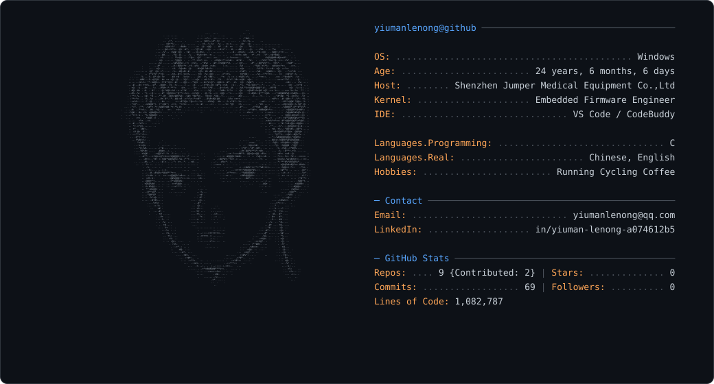

# yiumanlenong

Embedded firmware engineer

  <picture>
    <source media="(prefers-color-scheme: dark)" srcset="dark_mode.svg">
    <source media="(prefers-color-scheme: light)" srcset="light_mode.svg">
    
  </picture>

## About

- Focus: embedded firmware (C) and front-end development
- Learning: posture-recognition algorithms, 2.4G wireless communication, low-power design
- Hobbies: running · cycling · coffee
- Contact: yiumanlenong@qq.com
